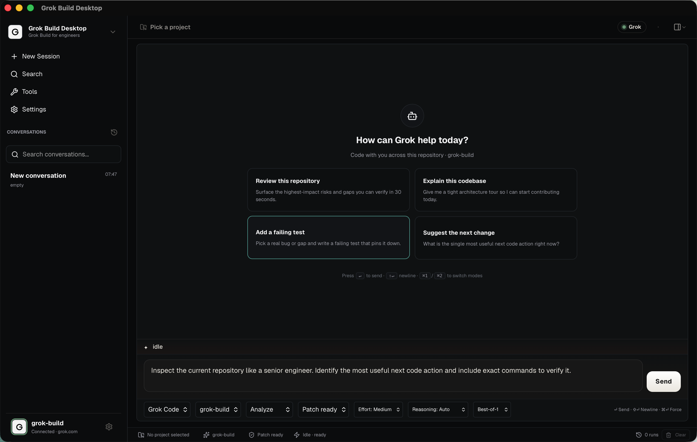
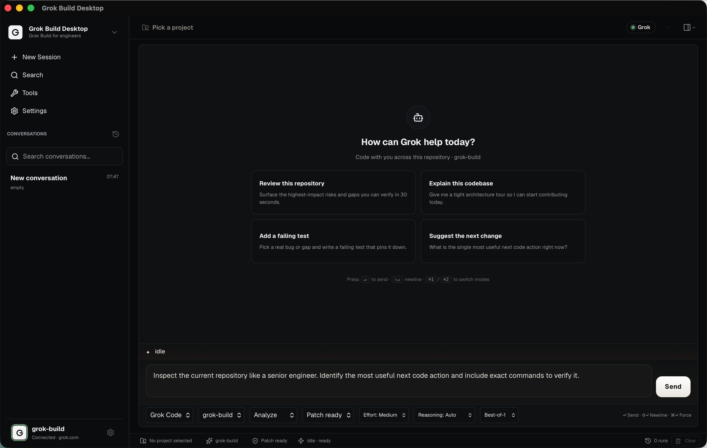

<div align="center">

# Grok Build Desktop

### A native desktop app for xAI's Grok CLI — a calm, Claude-Desktop-style home for coding with Grok.

If you live in the `grok` CLI, this gives it a real window: streaming answers, a sidebar of past conversations, MCP tools, and a Skills hub. No terminal-wrapper jank.

[](https://github.com/JaydenCJ/grok-build-desktop/stargazers)
[](#requirements)
[](#architecture)
[](#contributing)

[](https://github.com/JaydenCJ/grok-build-desktop/releases/latest)

<sub>Apple Silicon build · Windows / Intel: [build from source](#quick-start)</sub>

**English** · [日本語](#日本語) · [中文](#中文)

<br/>



<sub>Theme-aware light and dark.</sub>



<br/>

⭐ **If this is useful, a star helps other Grok users find it.** Issues and PRs welcome.

</div>

---

## English

### Overview

Grok Build Desktop turns the official **Grok Build CLI** into a native desktop coding app instead of a raw terminal wrapper. Two modes:

- **Grok Chat** — quick questions, product thinking, explanations, non-code tasks.
- **Grok Code** — repository inspection, implementation, debugging, reviews, tests, refactors, and terminal verification.

Grok is the only model path exposed in the UI. The model selector reflects exactly what your installed Grok CLI advertises via `grok models`, so you never silently fall back to a model you didn't pick.

### Features

- **Non-blocking streaming UI** — Grok runs use `--output-format streaming-json`; events flow through a Rust queue → typed Tauri events → a `useSyncExternalStore` store → an off-thread markdown Web Worker. The composer, panels, and theme toggle stay fully interactive while a run streams. Text reveals with natural typewriter pacing.
- **FIFO run queue** — type a new prompt while one is still streaming and it joins the queue (persisted in SQLite, survives restart).
- **Conversation history** — the sidebar lists your conversations newest-first, each titled by its first prompt; click one to reopen it in full. Rename, pin, group, archive, or delete any conversation; archived ones stay searchable from ⌘K.
- **Tools & Skills hub** — one page, two tabs. **MCP servers**: a catalog of community servers you can add/remove (`grok mcp`). **Skills**: a curated set of coding skills (code review, write tests, debug root-cause, commit message, PR description, explain codebase) that install a real `SKILL.md` into `~/.grok/skills` for Grok to discover.
- **Coding workflows + action policy** — Analyze / Implement / Review / Debug / Tests / Refactor starters, with an action policy (Review only / Patch ready / Autopilot) that maps to real Grok permission behaviour. Effort, reasoning effort, and best-of-N are one glance below the chat box.
- **Settings** — a Claude-Desktop-style modal (General / Model & reasoning / Permissions / Workspace / About).
- **Prompt library** — reusable prompt templates in SQLite with search-as-you-type and one-click insert.
- **Agent overlay** — a click-through, full-display edge border + animated cursor sprite that makes it obvious when Grok is acting. Strictly visual — no OS input synthesis.
- **Capability inspector** — Context / Skills / MCP / Agents / Plugins / Hooks / Permissions, combining `grok inspect` with managed `grok mcp` / `grok plugin` / `grok sessions`.

### Requirements

- **Node.js** 18+ and **npm**
- **Rust** (stable) + the Tauri prerequisites for your OS — see <https://tauri.app/start/prerequisites/>
- **Grok Build CLI** installed and logged in (`grok login`) — the primary runner
- macOS is the primary target; a Windows build target exists (`npm run tauri build` → MSI on `windows-latest`). Optional tools (browser-use, scrcpy) install separately.

### Quick Start

> 📦 **macOS (Apple Silicon): grab the prebuilt app from the [latest release](https://github.com/JaydenCJ/grok-build-desktop/releases/latest).** For Windows / Intel, build from source:

```bash
git clone https://github.com/JaydenCJ/grok-build-desktop.git
cd grok-build-desktop
npm install
npm run tauri:dev
```

macOS release bundle / stable local install:

```bash
npm run mac:build      # .app under src-tauri/target/release/bundle/
npm run mac:install    # build + ad-hoc sign + copy to ~/Applications + open
npm run mac:build:dmg  # optional DMG
```

Configuration: copy the example env file and fill in your own values (the file is git-ignored):

```bash
cp .env.example .env
```

Tauri dev does **not** auto-load `.env` — export the values in your shell before launching. All variables are documented in [`.env.example`](.env.example) and the [Configuration reference](#configuration-reference).

### Architecture

```
┌───────────────────────────────┐     streaming-json events     ┌──────────────────┐
│  React 19 UI (src/)           │ ◀───────────────────────────── │  Rust backend    │
│  store · worker · components  │ ──── Tauri commands ─────────▶ │  (src-tauri/)    │
└───────────────────────────────┘                                │  RunQueue (SQLite)│
                                                                 │  Grok subprocess  │
                                                                 └──────────────────┘
```

More in [`docs/architecture.md`](docs/architecture.md), [`docs/setup.md`](docs/setup.md), and [`docs/mac.md`](docs/mac.md).

### Development & testing

```bash
npm run check        # tsc --noEmit && cargo check
npm run build        # tsc && vite build (production)
npm test             # smoke test (scripts/smoke_test.mjs)
npm run test:unit    # vitest
npm run doctor       # environment doctor
```

### Roadmap

Open to ideas and PRs on any of these:

- [ ] Plan Mode view — separate "plan" from "apply", review the plan before edits run
- [ ] Sub-agent visualization — see what each agent is doing when a run fans out
- [ ] File references in the composer (`@path`) and an inline diff viewer
- [ ] A bigger, community-driven Skills catalog
- [ ] Linux build target

Have a use case? [Open an issue](https://github.com/JaydenCJ/grok-build-desktop/issues) and say what would make this your daily driver.

### Contributing

Contributions are genuinely welcome — bug fixes, features from the roadmap, or your own idea.

1. Fork and create a branch.
2. `npm install`, then `npm run check && npm test` before you push (keep them green).
3. Open a PR describing what changed and how to verify it.

Small, focused PRs get reviewed fastest. Not sure where to start? Issues labeled `good first issue` are a good entry point.

### License & contact

This repository is **source-available** under the terms in [`LICENSE`](LICENSE) (all rights reserved; see the file for what is and isn't permitted). Third-party attributions are in [`THIRD_PARTY_NOTICES.md`](THIRD_PARTY_NOTICES.md).

Questions or feedback: **gijirokuman@gmail.com**

---

## 日本語

### 概要

Grok Build Desktop は、公式の **Grok Build CLI** を生のターミナルラッパーではなく、ネイティブなデスクトップ・コーディングアプリに変えます。2 つのモード:

- **Grok Chat** — 簡単な質問、プロダクト思考、説明、コード以外のタスク。
- **Grok Code** — リポジトリ調査、実装、デバッグ、レビュー、テスト、リファクタ、ターミナル検証。

UI で公開されるモデル経路は Grok のみです。モデルセレクターはインストール済み Grok CLI が `grok models` で提示する内容をそのまま反映するため、選んでいないモデルに黙って戻ることはありません。

### 主な機能

- **ノンブロッキング・ストリーミング UI** — Grok 実行は `--output-format streaming-json` を使用。イベントは Rust キュー → 型付き Tauri イベント → `useSyncExternalStore` ストア → 別スレッドの Markdown Web Worker を経由します。実行中もコンポーザー・各パネル・テーマ切替は完全に操作可能で、テキストは自然なタイプライター速度で表示されます。
- **FIFO 実行キュー** — ストリーミング中に新しいプロンプトを入力するとキューに加わります(SQLite に永続化、再起動後も保持)。
- **会話履歴** — サイドバーに会話(セッション)を新しい順で一覧。最初のプロンプトがタイトルになり、クリックでその会話を丸ごと再開。リネーム・ピン・グループ・アーカイブ・削除に対応し、アーカイブも ⌘K で検索可能。
- **ツール & スキル ハブ** — 1 ページ 2 タブ。**MCP servers**: コミュニティ製サーバーを追加・削除(`grok mcp`)。**Skills**: 実用的なコーディングスキル(コードレビュー / テスト作成 / 原因デバッグ / コミットメッセージ / PR 説明 / コードベース解説)を `~/.grok/skills` に実際の `SKILL.md` として導入。
- **設定** — Claude Desktop 風モーダル(General / Model & reasoning / Permissions / Workspace / About)。
- **プロンプトライブラリ** — SQLite に保存される再利用可能なテンプレート。逐次検索とワンクリック挿入。
- **エージェント・オーバーレイ** — クリックスルーの全画面エッジボーダー＋アニメーションするカーソル。Grok の動作を明示します。完全に視覚的で、OS への入力合成は行いません。
- **コーディング・ワークフロー** — Analyze / Implement / Review / Debug / Tests / Refactor。アクションポリシー(Review only / Patch ready / Autopilot)は実際の Grok 権限フラグに対応します。
- **機能インスペクター** — Context / Skills / MCP / Agents / Plugins / Hooks / Permissions。`grok inspect` と管理系 `grok mcp` / `grok plugin` / `grok sessions` を統合。

### 必要環境

- **Node.js** 18 以上 と **npm**
- **Rust**(stable)+ OS ごとの Tauri 前提条件 — <https://tauri.app/start/prerequisites/>
- **Grok Build CLI**(インストール済み・`grok login` 済み)— 主要なランナー
- 主対象は macOS。Windows ビルドターゲットも存在します(`npm run tauri build` → `windows-latest` で MSI)。任意ツール(browser-use, scrcpy)は別途インストール。

### クイックスタート

> 📦 **macOS（Apple Silicon）はビルド済みアプリを[最新リリース](https://github.com/JaydenCJ/grok-build-desktop/releases/latest)からダウンロードできます。** Windows / Intel はソースからビルド:

```bash
git clone https://github.com/JaydenCJ/grok-build-desktop.git
cd grok-build-desktop
npm install
npm run tauri:dev
```

macOS リリースバンドル / 安定したローカルインストール:

```bash
npm run mac:build      # src-tauri/target/release/bundle/ 配下に .app
npm run mac:install    # ビルド + アドホック署名 + ~/Applications へコピー + 起動
npm run mac:build:dmg  # 任意の DMG
```

設定: サンプル env をコピーして自分の値を入れます(このファイルは git 管理外):

```bash
cp .env.example .env
```

Tauri dev は `.env` を自動読み込み**しません** — 起動前にシェルで export してください。全変数は [`.env.example`](.env.example) と [設定リファレンス](#configuration-reference) に記載。

### アーキテクチャ

[`docs/architecture.md`](docs/architecture.md)、[`docs/setup.md`](docs/setup.md)、[`docs/mac.md`](docs/mac.md) を参照(上の English 図と同じ構成)。

### 開発とテスト

```bash
npm run check        # tsc --noEmit && cargo check
npm run build        # tsc && vite build(本番)
npm test             # スモークテスト
npm run test:unit    # vitest
npm run doctor       # 環境ドクター
```

### ライセンスと連絡先

本リポジトリは [`LICENSE`](LICENSE) の条件に基づく **ソース公開(source-available)** です(all rights reserved — 許可される範囲はファイル参照)。サードパーティの帰属は [`THIRD_PARTY_NOTICES.md`](THIRD_PARTY_NOTICES.md)。

お問い合わせ: **gijirokuman@gmail.com**

---

## 中文

### 简介

Grok Build Desktop 把官方 **Grok Build CLI** 从裸终端封装升级为原生桌面编程应用。两种模式:

- **Grok Chat** — 快速提问、产品思考、解释说明、非代码任务。
- **Grok Code** — 仓库分析、实现、调试、评审、测试、重构与终端验证。

UI 中只暴露 Grok 这一条模型路径。模型选择器严格反映本机 Grok CLI 通过 `grok models` 实际声明的列表,绝不会静默回退到你没选的模型。

### 功能

- **非阻塞流式 UI** — Grok 运行使用 `--output-format streaming-json`;事件经 Rust 队列 → 类型化 Tauri 事件 → `useSyncExternalStore` store → 独立线程的 Markdown Web Worker。运行期间输入框、各面板、主题切换都保持完全可交互,文字以自然的打字机节奏逐字呈现。
- **FIFO 运行队列** — 上一条还在流式输出时再输入新 prompt,会自动加入队列(SQLite 持久化,重启不丢)。
- **会话历史** — 侧栏按时间倒序列出每个会话,以首条 prompt 为标题,点击即可完整重开。可重命名 / 置顶 / 分组 / 归档 / 删除任意会话;归档后仍可在 ⌘K 搜索到。
- **工具 & 技能中心** — 一页两个标签。**MCP servers**:社区服务器目录,一键增删(`grok mcp`)。**Skills**:精选编程技能(代码评审 / 写测试 / 根因调试 / 提交信息 / PR 描述 / 讲解代码库),一键把真实 `SKILL.md` 装进 `~/.grok/skills` 供 Grok 发现。
- **设置** — Claude Desktop 风格弹窗(General / Model & reasoning / Permissions / Workspace / About)。
- **Prompt 库** — 存于 SQLite 的可复用模板,边打边搜、一键插入。
- **Agent 浮层** — 穿透点击的全屏边缘高亮 + 动画光标,让 Grok 正在操作时一目了然。纯视觉,不做任何操作系统级输入合成。
- **编程工作流** — Analyze / Implement / Review / Debug / Tests / Refactor;动作策略(Review only / Patch ready / Autopilot)对应真实的 Grok 权限标志。
- **能力检查器** — Context / Skills / MCP / Agents / Plugins / Hooks / Permissions,整合 `grok inspect` 与受管的 `grok mcp` / `grok plugin` / `grok sessions`。

### 环境要求

- **Node.js** 18+ 与 **npm**
- **Rust**(stable)+ 对应系统的 Tauri 前置依赖 — 见 <https://tauri.app/start/prerequisites/>
- 已安装并登录(`grok login`)的 **Grok Build CLI** — 主运行器
- 主目标平台为 macOS;同时存在 Windows 构建目标(`npm run tauri build` → 在 `windows-latest` 产出 MSI)。可选工具(browser-use、scrcpy)需另行安装。

### 快速开始

> 📦 **macOS（Apple Silicon）可直接从[最新 Release](https://github.com/JaydenCJ/grok-build-desktop/releases/latest) 下载安装包。** Windows / Intel 请从源码构建:

```bash
git clone https://github.com/JaydenCJ/grok-build-desktop.git
cd grok-build-desktop
npm install
npm run tauri:dev
```

macOS 发布包 / 稳定本地安装:

```bash
npm run mac:build      # 产物在 src-tauri/target/release/bundle/
npm run mac:install    # 构建 + ad-hoc 签名 + 复制到 ~/Applications + 打开
npm run mac:build:dmg  # 可选 DMG
```

配置: 复制示例 env 并填入你自己的值(该文件已被 git 忽略):

```bash
cp .env.example .env
```

Tauri dev **不会**自动加载 `.env` — 启动前请在 shell 里 export。全部变量见 [`.env.example`](.env.example) 与 [配置参考](#configuration-reference)。

### 架构

见 [`docs/architecture.md`](docs/architecture.md)、[`docs/setup.md`](docs/setup.md)、[`docs/mac.md`](docs/mac.md)(与上方 English 图同构)。

### 开发与测试

```bash
npm run check        # tsc --noEmit && cargo check
npm run build        # tsc && vite build(生产)
npm test             # 冒烟测试
npm run test:unit    # vitest
npm run doctor       # 环境体检
```

### 许可与联系方式

本仓库依据 [`LICENSE`](LICENSE) 条款 **源码可见(source-available)**(all rights reserved — 允许范围见该文件)。第三方归属见 [`THIRD_PARTY_NOTICES.md`](THIRD_PARTY_NOTICES.md)。

问题或反馈: **gijirokuman@gmail.com**

---

## Configuration reference

All variables are also in [`.env.example`](.env.example). The Rust backend reads the `GROK_DESKTOP_*` names below (not any other prefix).

| Variable | Default | Purpose |
|---|---|---|
| `GROK_DESKTOP_PYTHON` | `python3` | Python interpreter for the tool bridges. |
| `GROK_DESKTOP_GROK_CMD` | `grok` | Grok CLI executable. |
| `GROK_DESKTOP_GROK_ARGS` | see `.env.example` | Argument template; `{prompt}` and `{mode}` are substituted. |
| `GROK_DESKTOP_GROK_CHECK` | `false` | Enable Grok's headless `--check` self-verification. |
| `GROK_DESKTOP_COMMAND_TIMEOUT_SECS` | `240` | Per-command timeout. |
| `GROK_DESKTOP_GROK_MAX_TURNS` | `12` | Bounded turn limit for headless runs. |
| `GROK_DESKTOP_VERBOSE_GROK_STDERR` | `0` | `1` shows raw Grok stderr (otherwise tracing noise is filtered). |
| `XAI_API_KEY` | — | Optional API-key auth (Grok can also use a cached `grok login`). |
| `BROWSER_USE_API_KEY` | — | Required only for the browser-use bridge. |
